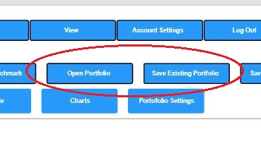
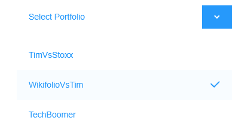
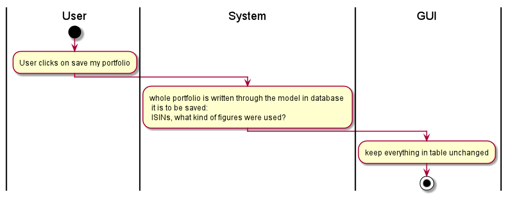

== Use-Case Specification: Access and Save Portfolio

== 1. Access and Save a Portfolio 

=== 1.1 Brief Description

A single user can access and save the specified portfolio (after he or she has changed it).

=== 1.2 Mockup

.Open Portfolio

.Save Portfolio
image::AdobeXDMockUp/Save Portfolio.png[]

== 2. Flow of Events

=== 2.1 Basic Flow

==== Activity Diagram

.Access the portfolio
image::AccessPortfolio.png[]

.Save the portfolio

==== .feature File

image::AccessSavePortfolio.JPG[]

link:../Django_Project/Feature/AccessSavePortfolio.feature[path to feature file]

=== 2.2 Alternative Flows

n/a

== 3. Special Requirements

n/a

== 4. Preconditions

The main preconditions for this use case are:

[arabic]
. The users app instance is registered.
. has a portfolio opened

== 5. Postconditions

n/a