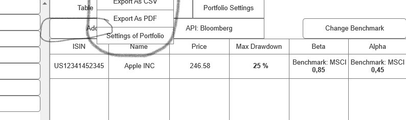
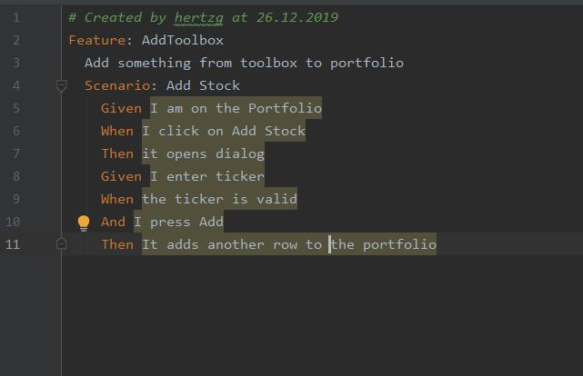

== Use-Case Specification: Add Stock

== 1. Add Stock

=== 1.1 Brief Description

Add Stock thus new row in portfolio.

=== 1.2 Mockup
*this is the relevant area:*

== 2. Flow of Events

=== 2.1 Basic Flow

==== Activity Diagram

image::AddStock.png[]

==== .feature File

link:../Django_Project/Feature/AddStock.feature[path to feature file]

=== 2.2 Alternative Flows

n/a

== 3. Special Requirements

n/a

== 4. Preconditions

The main preconditions for this use case are:

[arabic]
. The users app instance is registered.
. has a portfolio opened

== 5. Postconditions

n/a
