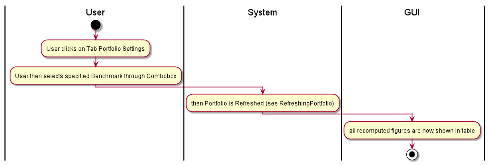
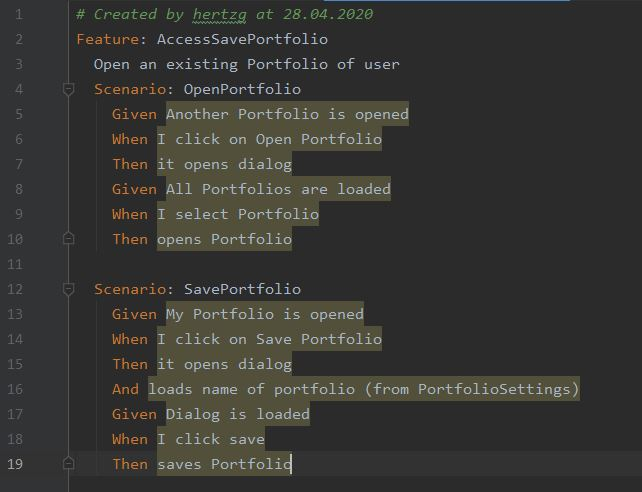

== Use-Case Specification: Change Portfolio Benchmark

== 1. Add Statistical Figure

=== 1.1 Brief Description

Most figures are calculated on a specific benchmark. (Stock versus Index). In this case a benchmark is an index.

=== 1.2 Mockup
.Buttons on main page
image::Portfolio Settings.png[]

== 2. Flow of Events

=== 2.1 Basic Flow

==== Activity Diagram

.Access the portfolio

==== .feature File

=== 2.2 Alternative Flows

n/a

== 3. Special Requirements

n/a

== 4. Preconditions

The main preconditions for this use case are:

[arabic]
. The users app instance is registered.
. has a portfolio opened

== 5. Postconditions

n/a