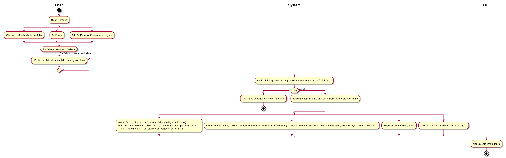
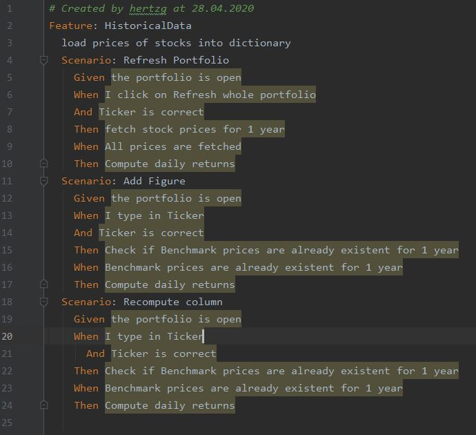

== Use-Case Specification: FetchHistoricalData

== 1. Fetching historical data

=== 1.1 Brief Description

On demand all figures are refreshed and figures are recomputed. Stock prices of the last year are fetched.

=== 1.2 Mockup
* generally updated in table

.this is the table
image::AdobeXDMockUp/Tabelle.png[]

== 2. Flow of Events

=== 2.1 Basic Flow

==== Activity Diagram

==== .feature File

link:../Django_Project/Feature/FetchHistoricalData.feature[path to feature file]

=== 2.2 Alternative Flows

n/a

== 3. Special Requirements

n/a

== 4. Preconditions

The main preconditions for this use case are:

[arabic]
. The users app instance is registered.
. has a portfolio opened
. a Benchmark is named

== 5. Postconditions

n/a