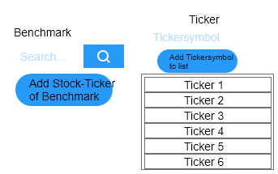
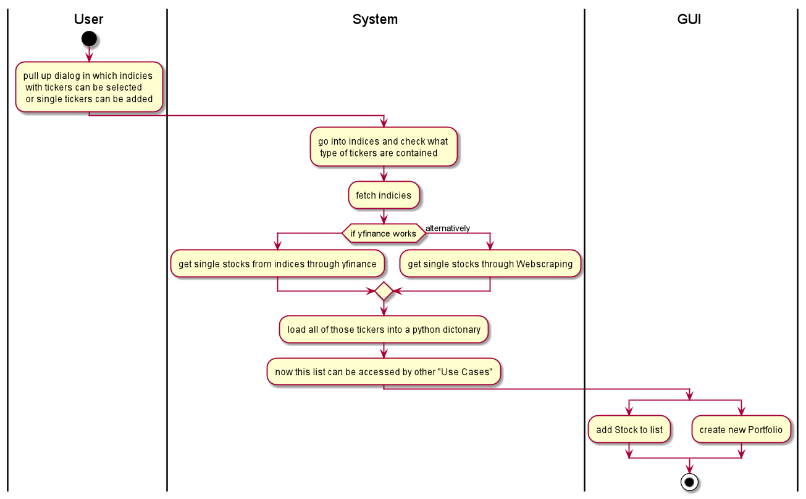
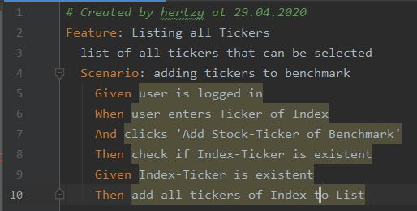

== Use-Case Specification: List ALl Tickers

== 1. List All Tickers

=== 1.1 Brief Description

In order not to have to rewrite all the tickers every time one is entering a stock - one can simply choose existing stocks from a combobox.

=== 1.2 Mockup
* generally updated in table

.this is the table

== 2. Flow of Events

=== 2.1 Basic Flow

==== Activity Diagram

==== .feature File

link:../Django_Project/Feature/ListAllTickers.feature[path to feature file]
=== 2.2 Alternative Flows

n/a

== 3. Special Requirements

n/a

== 4. Preconditions

The main preconditions for this use case are:

[arabic]
. The users app instance is registered.
. has a portfolio opened
. a Benchmark is named

== 5. Postconditions

n/a