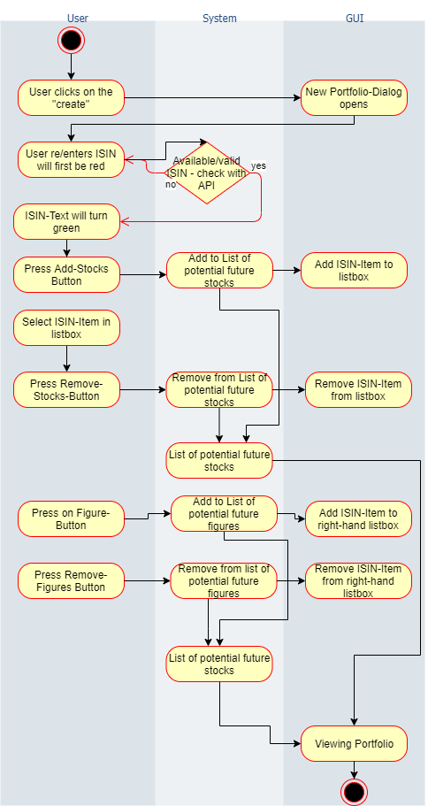

== Use-Case Specification: New Portfolio

== 1. Creating New Portfolio

=== 1.1 Brief Description

(- UC does not have to contain short description yet (soon .features files are due and relate to this part - so this will be inserted later on) http://dhbwse20192020.pbworks.com/w/page/136383315/S1_GC_Week4_UC)

=== 1.2 Mockup

image::Creating New Portfolio.png[]

== 2. Flow of Events

=== 2.1 Basic Flow

==== Activity Diagram

==== .feature File

yet to come

=== 2.2 Alternative Flows

n/a

== 3. Special Requirements

n/a

== 4. Preconditions

The main preconditions for this use case are:

[arabic]
. The users app instance is registered.
. The user is member of a group/shared flat.
. The user has started the app and has navigated to ``Shopping List''.

== 5. Postconditions

=== 5.1 Save changes / Sync with server

If a product has been added, edited or removed, it must be synced with
the server.

== 6. Function Points

To calculate function points, we used the tool on
http://groups.umd.umich.edu/cis/course.des/cis375/projects/fp99/main.html[http://groups.umd.umich.edu].

For this use case we set a score of _20_ function points. It took 790min
to implement this use case.

image:../FunctionPoints/ShoppingList.png[Function Points]