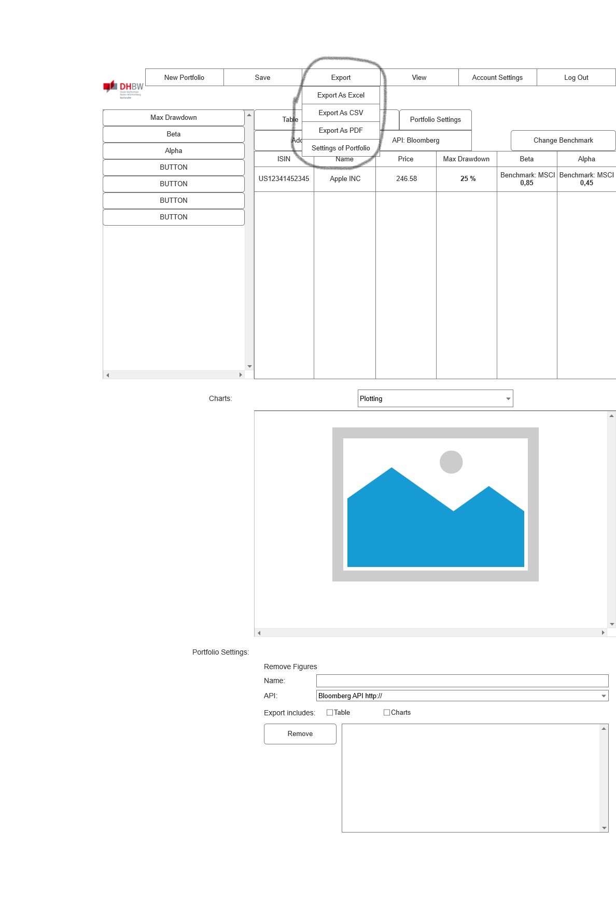
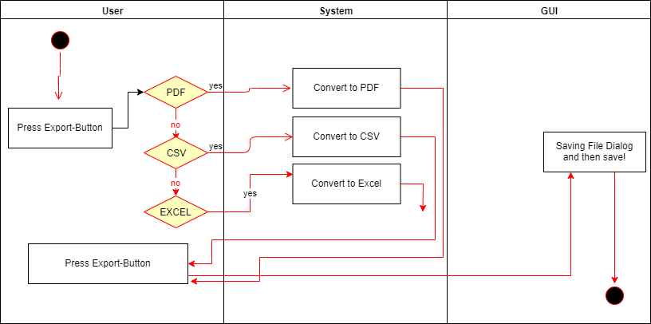
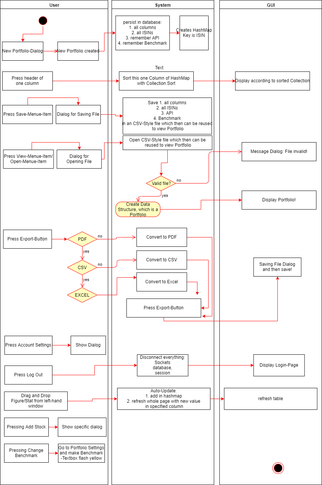

== Use-Case Specification: Portfolio View

== 1. Viewing Portfolio

=== 1.1 Brief Description

(- UC does not have to contain short description yet (soon .features files are due and relate to this part - so this will be inserted later on) http://dhbwse20192020.pbworks.com/w/page/136383315/S1_GC_Week4_UC)

=== 1.2 Mockup
This is part of CRUD
*this is the relevant area:*

== 2. Flow of Events

=== 2.1 Basic Flow

==== Activity Diagram
This is part of CRUD

*please ignore this one, it's merely for future use:*

_Check out whether this is actually a valid activity-diagram-> because not always connected_
_28.10.2019_

==== .feature File

yet to come

=== 2.2 Alternative Flows

n/a

== 3. Special Requirements

n/a

== 4. Preconditions

The main preconditions for this use case are:

[arabic]
. The users app instance is registered.

== 5. Postconditions

n/a
