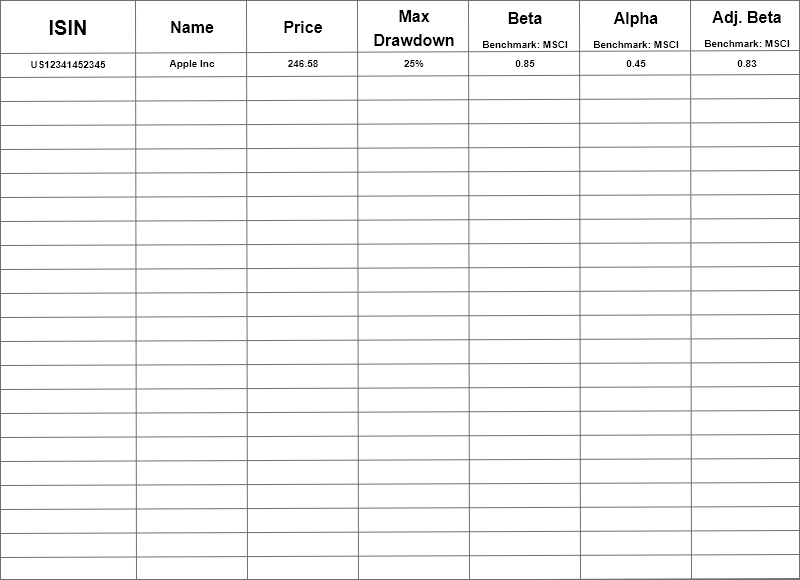
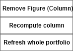
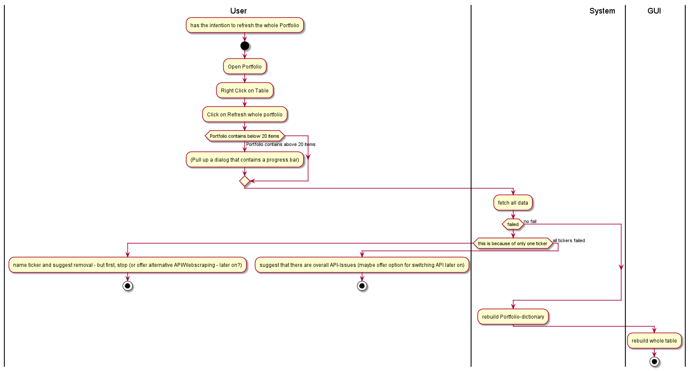
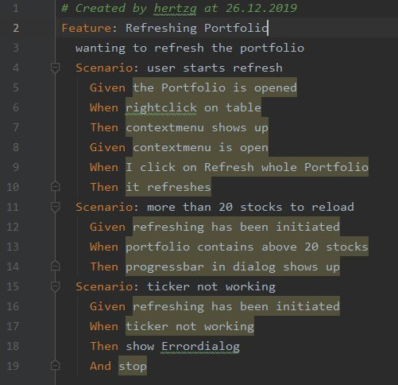

== Use-Case Specification: Refreshing whole Portfolio

== 1. Refreshing whole Portfolio

=== 1.1 Brief Description

On demand all figures are refreshed and figures recomputed.

=== 1.2 Mockup
.this is the table

.Right Click Context Menu

== 2. Flow of Events

=== 2.1 Basic Flow

==== Activity Diagram

.Activity Diagram in case of contextbar

==== .feature File

link:../Django_Project/Feature/RefreshingPortfolio.feature[path to feature file]

=== 2.2 Alternative Flows

n/a

== 3. Special Requirements

n/a

== 4. Preconditions

The main preconditions for this use case are:

[arabic]
. The users app instance is registered.
. has a portfolio opened

== 5. Postconditions

n/a