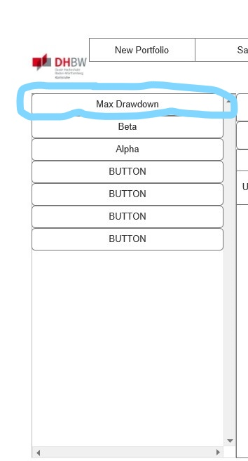
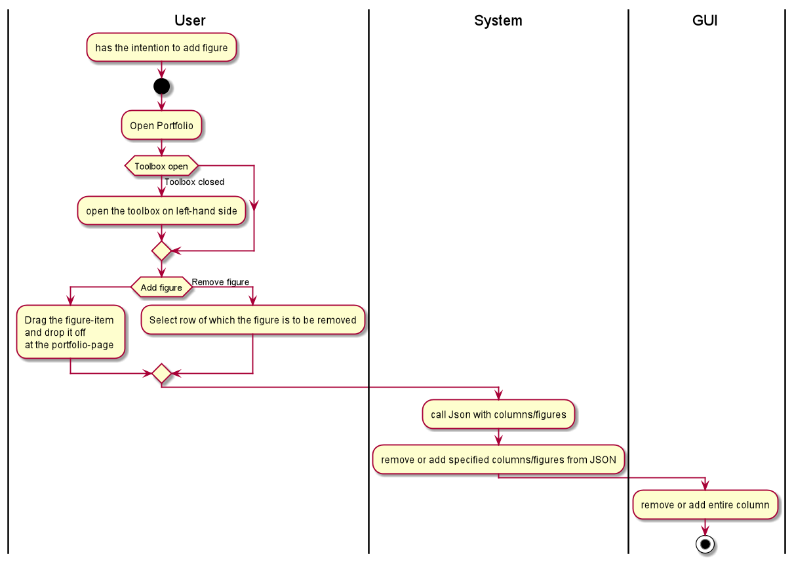

== Use-Case Specification: Add Figure

== 1. Add Figure

=== 1.1 Brief Description

Add figure column to portfolio. In each cell figure is being recomputed + for entire portfolio it's recomputed.

=== 1.2 Mockup
*this is the relevant area:*

== 2. Flow of Events

=== 2.1 Basic Flow

==== Activity Diagram
This is part of CRUD

==== .feature File

image::AddFigure.JPG[]

=== 2.2 Alternative Flows

n/a

== 3. Special Requirements

n/a

== 4. Preconditions

The main preconditions for this use case are:

[arabic]
. The users app instance is registered.
. has a portfolio opened

== 5. Postconditions

n/a
