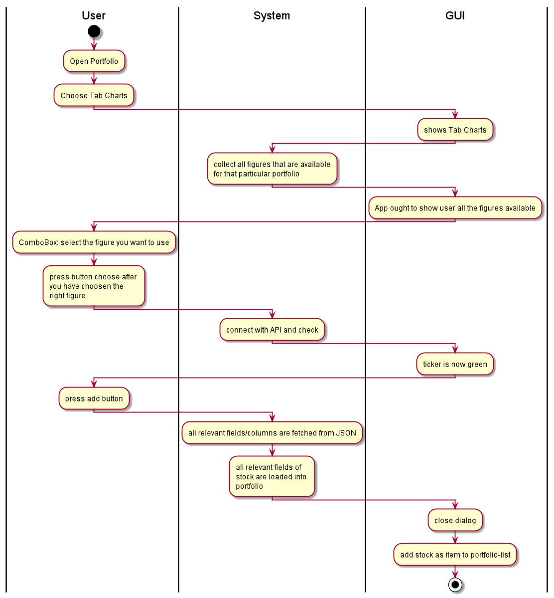

== Use-Case Specification: Create Chart

== 1. Create Chart

=== 1.1 Brief Description

Create Chart which is then being displayed and exported as download.

=== 1.2 Mockup
*this is the relevant area:*

image::MockUpCreateChartCircle.jpg[]

== 2. Flow of Events

=== 2.1 Basic Flow

==== Activity Diagram

==== .feature File

image::CreateChart.jpg[]

=== 2.2 Alternative Flows

n/a

== 3. Special Requirements

n/a

== 4. Preconditions

The main preconditions for this use case are:

[arabic]
. The users app instance is registered.
. has a portfolio opened

== 5. Postconditions

n/a